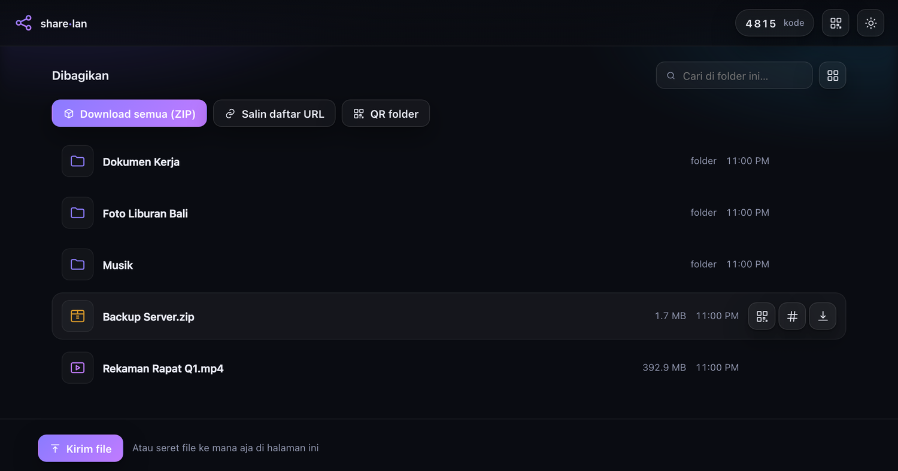
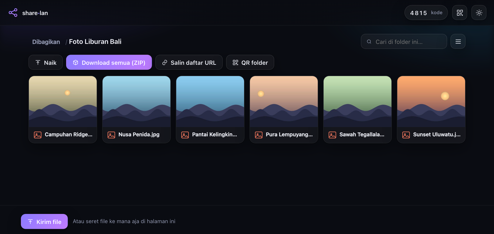
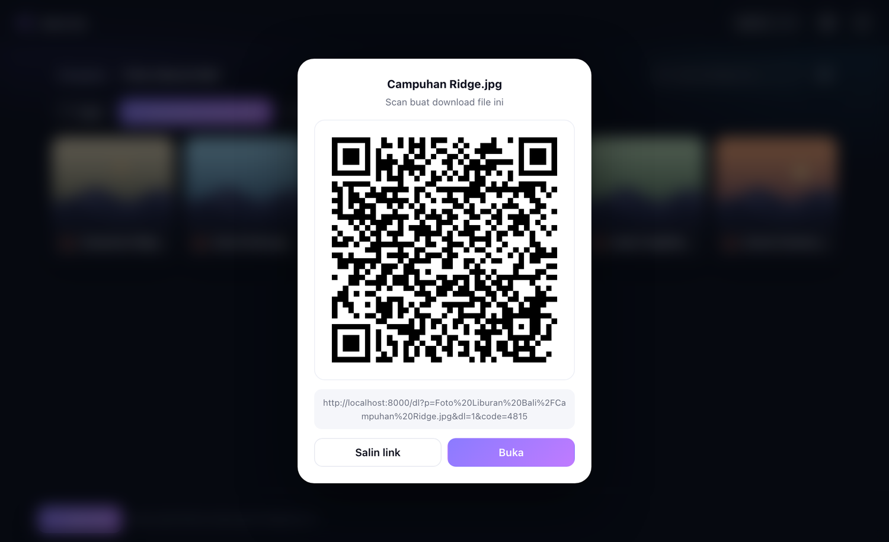
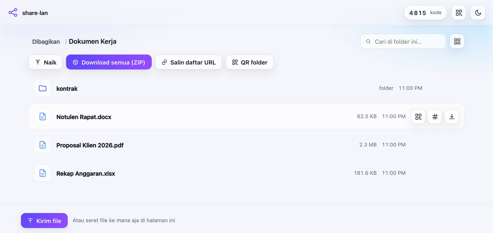
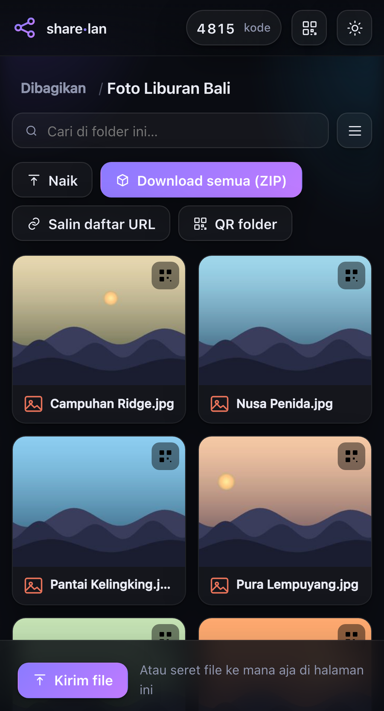

# share·lan

[](https://github.com/harizinside/share-lan/releases/latest)
[](https://github.com/harizinside/share-lan/actions/workflows/docker-publish.yml)
[](https://github.com/harizinside/share-lan/pkgs/container/share-lan)

Bagi file ke satu jaringan WiFi/LAN. Penerima tinggal **scan QR** (HP) atau **ketik IP + kode 4 digit** (laptop). Nggak ada cloud, nggak ada akun, penerima nggak perlu install apa pun — cukup browser.

```bash
uv run lanshare ~/Desktop/video.mp4
```



**Tanpa argumen, server nyala kosong** — nol file kebuka. Path-nya lu lempar belakangan sambil server jalan (lihat bagian berikutnya). Ini disengaja: default ke folder yang lagi aktif itu jebakan, bisa kebuka source code atau isi folder rumah tanpa lu sadar. Mau bagiin folder aktif? Sebutin titiknya: `uv run lanshare .`

## Cara pakai: terminal jadi dropzone

Ketik `uv run lanshare ` (pakai spasi di belakang), lalu **seret file/folder dari Finder ke jendela terminal** — path-nya nempel sendiri, spasi udah ke-escape. Drop sebanyak yang lu mau, campur file sama folder juga boleh, terus Enter.

```bash
uv run lanshare ~/Desktop/video.mp4 ~/Documents/laporan.pdf ~/Foto\ Liburan/
```

Yang muncul di terminal:

```
  ◆ share·lan  — nyala. Ctrl-C buat matiin.

  Dibagikan: 3 item
    • video.mp4        (412 MB)
    • laporan.pdf      (2.1 MB)
    • Foto Liburan/    (128 file, 3.4 GB)

  Alamat : http://192.168.1.7:8000   ← dipakai di QR
  Juga   : http://macbook.local:8000  (tahan ganti IP)
  Kode   : 4815

  [ QR code ]

  → Ke HP    : scan QR di atas
  → Ke laptop: kasih alamat + kode di atas
```

**Ke HP**: arahin kamera bawaan ke QR — kode akses ikut kebawa di URL, jadi nol ketikan.
**Ke laptop**: sebutin alamat + 4 angka, mereka ketik di browser.

### Nambah file sambil server jalan

Server-nya bisa dinyalain kosong dulu, terus diisi belakangan — QR-nya udah bisa discan dari awal:

```bash
uv run lanshare
```

Setelah nyala, terminal itu jadi kendali. Seret file/folder dari Finder ke jendela terminal terus Enter, atau ketik path-nya:

```
  + video.mp4  (412 MB)
  Sekarang 1 item dibagikan.

ls          lihat yang lagi dibagikan
rm <nama>   cabut satu (boleh pakai nomornya, mis. rm 2)
qr          tampilkan ulang alamat + QR
q           matiin server
```

Halaman yang **udah kebuka di HP orang bakal update sendiri** dalam beberapa detik — nggak usah minta mereka refresh, dan QR yang udah discan tetap berlaku. Kalau lu `rm` sesuatu, akses ke situ langsung putus.

### Nggak ada file yang disalin

Yang disimpan server cuma **path**-nya. File 200 GB di `~/Documents` tetap duduk di `~/Documents` — dibaca langsung dari situ pas ada yang download, nggak pernah dipindah, disalin, atau ditaruh di folder tempat lu jalanin. Satu-satunya hal yang beneran ditulis ke disk itu **file yang orang lain upload ke lu**, dan itu masuk ke folder yang **lagi dibuka penerima pas upload** — bukan lompat ke root.

Kalau yang lu drop cuma **satu file**, QR-nya nunjuk persis ke file itu — scan, langsung kedownload, tanpa mampir ke daftar.

## Yang bisa dilakuin penerima

- Lihat & telusuri folder, cari file, mode daftar atau grid dengan thumbnail
- Download per file, atau satu folder sekaligus sebagai ZIP
- **Preview langsung di browser** — klik ikon mata: PDF, gambar, video, audio, dan teks
  kebuka pakai viewer bawaan browser; format Office (docx, xlsx, pptx, odt, rtf, dst)
  ke-render jadi HTML pakai [GroupDocs.Viewer](https://pypi.org/project/groupdocs-viewer-net/)
  kalau terpasang (`uv pip install groupdocs-viewer-net` atau `uv run --extra viewer`)
- Klik tombol QR di baris mana pun → QR gede buat item itu (buat nunjuk satu file ke HP orang)
- Streaming video/audio langsung di browser tanpa download penuh
- Kirim file balik ke lu (drag & drop, bisa dimatiin pakai `--read-only`)
- Ambil SHA-256 per file atau `SHA256SUMS` satu folder buat mastiin hasilnya utuh

### Tampilannya

Folder yang isinya dominan gambar kebuka sebagai galeri, lengkap sama thumbnail — bukan daftar teks:



Tiap baris punya tombol QR sendiri. Klik → QR gede di tengah layar, sodorin ke muka orang, HP mereka langsung download file itu:



Tema ikut sistem, dan terangnya digarap beneran — bukan sekadar dibalik warnanya:



Di HP, listing-nya nyusun ulang jadi satu-dua kolom dengan target sentuh yang gede:

<p align="center"></p>

## Transfer file gede

**Download per file selalu bisa di-resume.** Pakai `Accept-Ranges` + `sendfile` (zero-copy di kernel), jadi putus di 180 GB tinggal dilanjut, bukan diulang.

**ZIP folder** ada dua mode, otomatis kepilih dari ukurannya:

| Ukuran folder | Mode | Bisa resume? |
|---|---|---|
| ≤ 20 GB (`--zip-resume-limit`) | CRC dihitung duluan, layout ZIP dipetakan persis | **Ya** |
| > 20 GB | Streaming | Nggak |

Buat yang di atas ambang, UI-nya ngasih tau terus terang dan nyediain tombol **"Salin daftar URL"**. Tempel hasilnya ke file, terus di sisi penerima:

```bash
aria2c -i list.txt          # paralel + resume per file
wget -c -i list.txt         # alternatif
```

Buat ratusan GB, cara ini yang paling waras: paralel, dan kalau satu file gagal cuma itu yang diulang.

## Opsi

```
lanshare [PATH ...]

  (tanpa PATH: server nyala kosong, path dilempar lewat terminal)

  --port N              port (default 8000, loncat sendiri kalau kepake)
  --host ADDR           alamat bind (default 0.0.0.0)
  --ip ADDR             paksa alamat yang ditampilin di QR
  --code KODE           kode akses sendiri (default: acak)
  --code-len N          panjang kode acak (default 4)
  --max-upload UKURAN   batas per upload, mis. 2G
  --read-only           matiin upload
  --hidden              ikutin file/folder tersembunyi
  --no-qr               jangan cetak QR di terminal
  --zip-resume-limit U  ambang ZIP resumable (default 20G)
  --no-caffeinate       jangan cegah Mac ketiduran
```

## Keamanan

- **HTTP polos, nggak dienkripsi.** Aman buat WiFi rumah/kantor; jangan buat data sensitif di WiFi publik (kafe, bandara).
- **Kode 4 digit ditahan sama remnya, bukan sama panjangnya.** 5× salah → IP dikunci 60 detik, dan tiap ronde gagal berikutnya kuncinya dilipatduakan (maks 15 menit). Karena ganti IP itu gampang di LAN, ada juga penghitung global: 50× gagal → kode diganti otomatis dan QR baru dicetak. Butuh lebih ketat? `--code-len 6`.
- Semua path divalidasi balik ke folder yang lu bagikan — `../` dan symlink yang nunjuk keluar ditolak.
- Nama file upload disanitasi (komponen path, `..`, karakter kontrol, nama cadangan Windows), plus cek sisa disk.
- **Kode akses bukan pengganti VPN** — dia cuma nyegah orang iseng yang nge-scan port di jaringan yang sama.
- Server **nggak mindahin atau nyalin apa pun**. File tetap di tempatnya, cuma dibaca pas ada yang download. Ctrl-C = akses langsung putus.

## Kalau nggak kebuka dari HP

1. Pastiin dua device di WiFi yang sama.
2. macOS bakal nanya izin firewall pas pertama jalan → pilih **Allow**.
3. Punya VPN/Docker/Tailscale nyala? Alamat yang kepilih bisa jadi punya interface itu. Banner nampilin alternatifnya — coba yang lain, atau paksa pakai `--ip`.
4. Router kantor/hotel kadang nyalain "AP isolation" yang ngeblokir device saling ngobrol.

## Catatan teknis

Servernya paket Python biasa (folder `lanshare/`, satu modul kecil per tanggung jawab — mount, auth, HTTP, ZIP, halaman, dst), dependency (`qrcode`, `pillow`, `pypdfium2`) dideklarasiin di `pyproject.toml` — uv yang ngurus instalasinya. Pillow opsional: kalau nggak ada, thumbnail mati dan UI mundur ke ikon, sisanya jalan normal. `groupdocs-viewer-net` juga opsional (`--extra viewer`): kalau nggak ada, preview dokumen Office mati dan PDF/gambar/media tetap ke-preview pakai viewer browser. Sisanya stdlib.

## Install lewat satu baris (tanpa clone)

Belum punya repo ini di komputer? Satu baris ini install `lanshare` langsung, cuma butuh Python
(nggak perlu `uv`, `git`, atau apa pun lain):

macOS / Ubuntu / Fedora / Linux lain:

```bash
curl -LsSf https://raw.githubusercontent.com/harizinside/share-lan/main/install.sh | sh
```

Windows (PowerShell):

```powershell
powershell -ExecutionPolicy ByPass -c "irm https://raw.githubusercontent.com/harizinside/share-lan/main/install.ps1 | iex"
```

Abis itu tinggal panggil `sharelan` (atau alias lama `lanshare`) dari terminal manapun.

### Update aplikasi

Mulai v0.0.2, update instalasi yang sudah ada ke rilis GitHub terbaru:

```bash
sharelan update
sharelan --version
```

`lanshare update` juga bisa. Kalau masih pakai v0.0.1, jalankan ulang installer
satu baris di atas sekali untuk mendapatkan command baru ini.
Update memakai Python instalasi yang sedang dijalankan; butuh koneksi internet.
Setelah selesai, jalankan ulang server agar kode baru dipakai.
Instalasi editable dari repo: gunakan `git pull` lalu `uv sync`.
Docker: gunakan `docker compose pull` lalu `docker compose up -d`.
Untuk membagikan file/folder bernama `update`, tulis `sharelan ./update`.

## Jalan tanpa ngetik `uv run`

`pyproject.toml` ndaftarin `lanshare` sebagai command global. Install sekali pakai `uv tool install`, terus bisa dipanggil langsung dari mana aja tanpa `uv run`:

```bash
uv tool install --editable .
lanshare ~/Desktop/video.mp4
```

`--editable` bikin perubahan di kode langsung kepakai tanpa install ulang.

## Jalan lewat Docker

Image resminya dipublish ke GHCR lewat GitHub Actions tiap push ke `main`/tag rilis
(`.github/workflows/docker-publish.yml`) — `docker-compose.yaml` di root repo sudah
siap pakai:

```bash
mkdir -p shared && cp file-yang-mau-dibagi shared/
docker compose up -d
docker compose logs -f      # lihat QR + kode 4 digit di sini
```

Folder host `./shared` ke-mount ke `/data` di dalam container; edit `command:` di
compose file buat nambah flag lain (`--read-only`, `--code`, `--max-upload`, dst — lihat
[Opsi](#opsi)).

Catatan jaringan: container punya network namespace sendiri, jadi deteksi IP LAN
otomatis (`--ip`, banner, QR) bisa nunjuk ke alamat internal Docker, bukan IP LAN host
yang beneran. Kalau itu kejadian, uncomment `network_mode: host` di
`docker-compose.yaml` (Linux saja) biar share-lan lihat network host langsung, atau
paksa manual pakai `--ip <ip-lan-host>`.

Mau build sendiri dari source, bukan pull dari GHCR? Ganti `image:` jadi `build: .` di
compose file, atau langsung:

```bash
docker build -t share-lan .
docker run --rm -p 8000:8000 -v "$(pwd)/shared:/data" share-lan
```

## Development

Lint, format, dan tes pakai perkakas Astral (`ruff` + `pytest`, dikelola `uv`):

```bash
uv run --group dev ruff check .      # lint
uv run --group dev ruff format .     # format
uv run --group dev pytest            # tes
```

100 tes, jalan ~3 detik, kebagi jadi empat berkas:

| Berkas | Isi |
|---|---|
| `tests/test_unit.py` | Format ukuran, parsing `--max-upload`, sanitasi nama upload, parsing header `Range`, penamaan mount kembar |
| `tests/test_paths.py` | Keamanan path: `../`, path absolut, symlink yang nunjuk keluar, dotfile, file `.part` |
| `tests/test_zip.py` | Layout byte ZIP persis, hasil potong-potong harus identik sama sekali-ambil (**ini yang menjamin resume**), ZIP64, unicode, cache CRC |
| `tests/test_http.py` | End-to-end lewat HTTP: auth, alur scan, rate limit, Range/416/multi-range, resume ZIP, mode streaming, upload, batas ukuran, read-only, `/sums`, `/urls`, `/qr`, `/thumb` |

Konfigurasinya ada di `pyproject.toml`.
